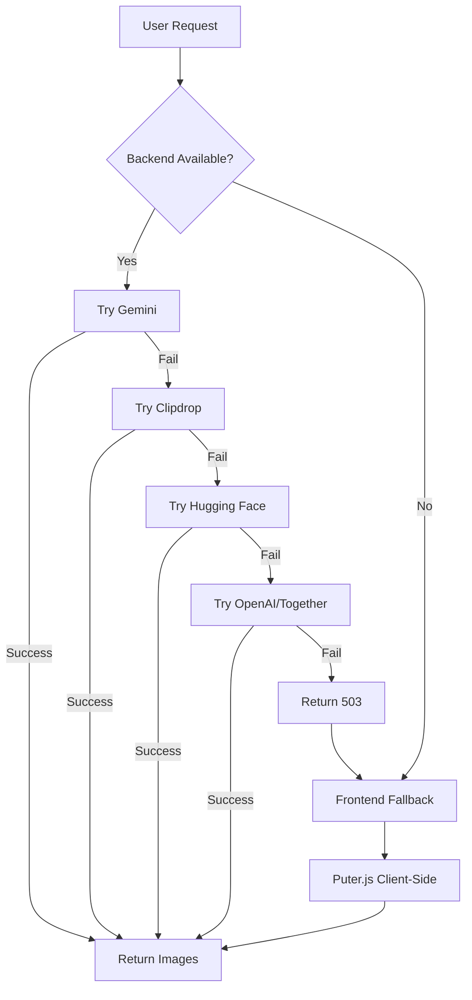

# 🍐 PearMedia AI

**Enterprise-Grade AI Content Enhancement & Generation Platform**

[](https://react.dev)
[](https://vitejs.dev)
[](https://vercel.com)
[](https://ai.google.dev)
[](LICENSE)

---

## 📑 Table of Contents

- [Overview](#-overview)
- [Key Features](#-key-features)
- [Architecture](#️-architecture)
- [Tech Stack](#-tech-stack)
- [Getting Started](#-getting-started)
- [Environment Variables](#️-environment-variables)
- [API Reference](#-api-reference)
- [Workflows](#-workflows)
- [Fallback Strategy](#-fallback-strategy)
- [Deployment](#-deployment)
- [Contributing](#-contributing)
- [License](#-license)

---

## 🎯 Overview

PearMedia AI is a **production-ready**, **fault-tolerant** AI content platform that leverages multiple AI providers with intelligent fallback mechanisms. The platform guarantees image generation even when primary providers are unavailable, making it ideal for production deployments where reliability is critical.

### Why PearMedia AI?

- **🛡️ Never Fails**: Multi-provider architecture with 5 fallback layers
- **💰 Cost Optimized**: Prioritizes free/cheap providers before paid options
- **🚀 Fast**: Uses fastest available provider automatically
- **🌐 Universal**: Works without any API keys using client-side Puter.js fallback

---

## ✨ Key Features

### 🔄 Resilient Multi-Provider Pipeline

| Priority | Provider | Type | Cost |
|----------|----------|------|------|
| 1️⃣ | **Google Gemini** | Vision + Generation | Free Tier |
| 2️⃣ | **Clipdrop (Stability AI)** | SDXL Generation | 100 Free Credits |
| 3️⃣ | **Hugging Face** | FLUX.1-dev | Free Tier |
| 4️⃣ | **OpenAI / Together.ai** | DALL-E 3 / FLUX.1-schnell | Paid |
| 5️⃣ | **Puter.js** (Client-Side) | Free AI Cloud | $0 Forever |

### 🎨 Dual Workflow System

#### Text Workflow (4 Steps)
```
Input → Analyze → Approve → Generate
```
- AI-powered prompt enhancement using GPT-4o-mini
- Intent, tone, and style analysis
- Side-by-side prompt comparison
- Multi-image generation

#### Image Workflow (3 Steps)
```
Upload → Analyze → Generate Variations
```
- Vision AI analysis (Objects, Style, Mood, Lighting)
- Automatic prompt suggestion
- Variation generation from uploaded images

### 🔒 Security Features

- **Security Headers**: `X-Content-Type-Options`, `X-Frame-Options`, `Referrer-Policy`
- **Input Validation**: Type checking, length limits, format validation
- **API Key Protection**: Server-side only, never exposed to client
- **Content Policy**: OpenAI content policy enforcement

---

## 🏗️ Architecture

### System Overview

```
┌─────────────────────────────────────────────────────────────────────────┐
│                           React Frontend                                 │
│    ┌──────────────────────┐         ┌──────────────────────┐           │
│    │    TextWorkflow      │         │    ImageWorkflow     │           │
│    │  (4-Step Process)    │         │  (3-Step Process)    │           │
│    └──────────┬───────────┘         └──────────┬───────────┘           │
│               │                                 │                       │
│               │   ┌─────────────────────────────┘                       │
│               │   │                                                     │
│               ▼   ▼                                                     │
│    ┌──────────────────────────────────────────────────────────┐        │
│    │              Puter.js (Client-Side Fallback)             │        │
│    │              window.puter.ai.txt2img()                   │        │
│    │              window.puter.ai.chat()                      │        │
│    └──────────────────────────────────────────────────────────┘        │
└────────────────────────────────┬────────────────────────────────────────┘
                                 │ HTTPS/JSON
                                 ▼
┌─────────────────────────────────────────────────────────────────────────┐
│                     Vercel Serverless Functions                          │
│                                                                          │
│  ┌────────────────┐  ┌────────────────┐  ┌────────────────┐            │
│  │ enhance-text   │  │ analyze-image  │  │ generate-image │            │
│  │     .js        │  │     .js        │  │     .js        │            │
│  └───────┬────────┘  └───────┬────────┘  └───────┬────────┘            │
│          │                   │                   │                      │
│          ▼                   ▼                   ▼                      │
│  ┌────────────┐      ┌────────────────┐   ┌──────────────────────┐     │
│  │ OpenAI/HF  │      │ Gemini Vision  │   │   Provider Router    │     │
│  │ GPT-4o-mini│      │ (6 Model       │   │ ┌───────────────────┐│     │
│  └────────────┘      │  Fallbacks)    │   │ │ 1. Gemini         ││     │
│                      │ + OpenAI       │   │ │ 2. Clipdrop       ││     │
│                      │   Fallback     │   │ │ 3. Hugging Face   ││     │
│                      └────────────────┘   │ │ 4. OpenAI/Together││     │
│                                           │ │ 5. → 503 → Puter  ││     │
│                                           │ └───────────────────┘│     │
│                                           └──────────────────────┘     │
└─────────────────────────────────────────────────────────────────────────┘
```

### Fallback Flow Diagram



---

## 🔧 Tech Stack

| Category | Technology | Version | Purpose |
|----------|------------|---------|---------|
| **Frontend** | React | 18.3 | Component-based UI |
| **Build Tool** | Vite | 6.0 | Fast HMR & bundling |
| **Styling** | Vanilla CSS | - | Glassmorphism design system |
| **Backend** | Vercel Serverless | - | Auto-scaling API endpoints |
| **Primary Vision** | Google Gemini | 1.5 Flash | Image analysis |
| **Primary Generation** | Google Gemini | Imagen 3 | High-quality images |
| **Fallback Generation** | Clipdrop | SDXL | Stability AI images |
| **Free Fallback** | Hugging Face | FLUX.1-dev | Community models |
| **Client Fallback** | Puter.js | v2 | Zero-cost cloud AI |
| **Linting** | ESLint | 9.17 | Code quality |

---

## 🚀 Getting Started

### Prerequisites

- **Node.js** 18.0 or higher
- **npm** or **yarn**
- At least ONE API key (Gemini recommended) OR none for Puter.js-only mode

### Installation

```bash
# 1. Clone the repository
git clone https://github.com/Mrajpal07/PearMediaLLC.git
cd PearMedia

# 2. Install dependencies
npm install

# 3. Configure environment
cp .env.example .env.local
# Edit .env.local with your API keys

# 4. Start development server
npm run dev
```

### Running with Serverless Functions

```bash
# Install Vercel CLI (if not installed)
npm i -g vercel

# Run with full backend support
vercel dev
```

The app will be available at `http://localhost:3000`.

---

## ⚙️ Environment Variables

### Minimal Configuration (Recommended)

```bash
# .env.local

# Google Gemini - Primary provider (Free tier available)
GOOGLE_API_KEY=AIzaSy...

# Optional fallbacks
CLIPDROP_API_KEY=your-clipdrop-key
HUGGINGFACE_API_KEY=hf_...
```

### Full Configuration

```bash
# ============================================
# PRIMARY PROVIDERS
# ============================================

# Google Gemini (Vision + Generation) - RECOMMENDED
GOOGLE_API_KEY=AIzaSy...

# Clipdrop (SDXL Generation) - High Quality Fallback
CLIPDROP_API_KEY=...

# Hugging Face (FLUX.1-dev) - Free Tier
HUGGINGFACE_API_KEY=hf_...

# ============================================
# LEGACY/OPTIONAL PROVIDERS
# ============================================

# OpenAI (GPT-4o-mini, DALL-E 3)
OPENAI_API_KEY=sk-...
OPENAI_BASE_URL=https://api.openai.com/v1
OPENAI_MODEL=gpt-4o-mini
VISION_MODEL=gpt-4o

# Together.ai (FLUX.1-schnell)
TOGETHER_API_KEY=...

# ============================================
# GENERATION SETTINGS
# ============================================

IMAGE_COUNT=2          # Images per request (1-4)
IMAGE_SIZE=1024x1024   # Output resolution
IMAGE_QUALITY=standard # standard | hd
```

### Provider Priority

The system automatically detects available API keys and uses them in this order:

1. **GOOGLE_API_KEY** → Gemini Imagen 3
2. **CLIPDROP_API_KEY** → Clipdrop SDXL
3. **HUGGINGFACE_API_KEY** → FLUX.1-dev
4. **OPENAI_API_KEY** → DALL-E 3
5. **TOGETHER_API_KEY** → FLUX.1-schnell
6. **None configured** → Frontend uses Puter.js

---

## 📚 API Reference

### POST `/api/enhance-text`

Analyzes user prompts and enhances them for optimal image generation.

**Request:**
```json
{
  "prompt": "a cat on a windowsill"
}
```

**Response:**
```json
{
  "analysis": {
    "intent": "Create an image of a cat in a cozy indoor setting",
    "tone": "Peaceful and contemplative",
    "style": "Photorealistic with warm lighting"
  },
  "enhancedPrompt": "A fluffy tabby cat with green eyes sits gracefully on a sunlit wooden windowsill, warm golden hour lighting streaming through sheer white curtains, photorealistic style, shallow depth of field"
}
```

**Model:** GPT-4o-mini | **Latency:** 2-4s | **Cost:** ~$0.0002/request

---

### POST `/api/analyze-image`

Analyzes uploaded images using vision AI models.

**Request:**
```json
{
  "imageBase64": "data:image/jpeg;base64,..."
}
```

**Response:**
```json
{
  "analysis": {
    "objects": ["cat", "windowsill", "curtains"],
    "style": "Photorealistic photography",
    "mood": "Peaceful, contemplative",
    "lighting": "Warm golden hour sunlight"
  },
  "suggestedPrompt": "A fluffy tabby cat sitting on a wooden windowsill..."
}
```

**Vision Models Tried (in order):**
1. `gemini-1.5-flash-001`
2. `gemini-1.5-flash-002`
3. `gemini-1.5-flash`
4. `gemini-1.5-flash-8b`
5. `gemini-2.0-flash-exp`
6. `gemini-1.5-pro`
7. *OpenAI GPT-4o* (fallback)

---

### POST `/api/generate-image`

Generates images using the best available provider.

**Request:**
```json
{
  "prompt": "A futuristic city with flying cars",
  "style": "cinematic"
}
```

**Response:**
```json
{
  "images": [
    "data:image/png;base64,...",
    "data:image/png;base64,..."
  ]
}
```

**Error Response (503):**
```json
{
  "error": "All providers failed. Frontend will use Puter.js."
}
```

---

## 🔄 Workflows

### Text Workflow

| Step | Action | API Called |
|------|--------|------------|
| 1. Input | User enters prompt | - |
| 2. Analyze | AI analyzes intent, tone, style | `/api/enhance-text` |
| 3. Approve | User reviews enhanced prompt | - |
| 4. Generate | Creates images | `/api/generate-image` |

### Image Workflow

| Step | Action | API Called | Fallback |
|------|--------|------------|----------|
| 1. Upload | User uploads image | - | - |
| 2. Analyze | Vision AI analysis | `/api/analyze-image` | Puter.js Chat |
| 3. Generate | Create variations | `/api/generate-image` | Puter.js txt2img |

---

## 🛡️ Fallback Strategy

PearMedia AI implements a **"Never Fail"** architecture using a hybrid server/client approach:

### Server-Side Fallback Chain

```javascript
// Priority: Gemini → Clipdrop → Hugging Face → OpenAI/Together
try {
    return await generateWithGemini(prompt)
} catch {
    try { return await generateWithClipdrop(prompt) } 
    catch { return await generateWithHuggingFace(prompt) }
}
// If all fail → Return 503
```

### Client-Side Ultimate Fallback

When the backend returns 503 (or any error), the frontend automatically switches to **Puter.js**:

```javascript
// Frontend (ImageWorkflow.jsx)
catch (error) {
    // Backend failed → Use Puter.js
    const img = await window.puter.ai.txt2img(prompt)
    images.push(img.src)
}
```

**Benefits:**
- ✅ Works even with NO API keys configured
- ✅ Free for end users (Puter's "User-Pays" model)
- ✅ No server costs when using client-side fallback

---

## 🌐 Deployment

### Vercel (Recommended)

1. **Push to GitHub:**
   ```bash
   git add .
   git commit -m "Deploy"
   git push origin main
   ```

2. **Import to Vercel:**
   - Go to [vercel.com/new](https://vercel.com/new)
   - Import your repository
   - Vercel auto-detects Vite configuration

3. **Configure Environment Variables:**
   - Navigate to Settings → Environment Variables
   - Add your API keys (at minimum: `GOOGLE_API_KEY`)

4. **Deploy!**

### Docker (Alternative)

```dockerfile
FROM node:18-alpine
WORKDIR /app
COPY package*.json ./
RUN npm ci
COPY . .
RUN npm run build
EXPOSE 3000
CMD ["npm", "run", "preview"]
```

---

## 📁 Project Structure

```
PearMedia/
├── api/                          # Vercel Serverless Functions
│   ├── analyze-image.js          # Vision analysis (Gemini/OpenAI)
│   ├── enhance-text.js           # Prompt enhancement (GPT-4o-mini)
│   ├── generate-image.js         # Image generation (5 providers)
│   └── test-env.js               # Environment test endpoint
├── src/
│   ├── components/
│   │   ├── TextWorkflow.jsx      # 4-step text workflow
│   │   ├── TextWorkflow.css
│   │   ├── ImageWorkflow.jsx     # 3-step image workflow
│   │   └── ImageWorkflow.css
│   ├── App.jsx                    # Main application
│   ├── App.css                    # App styles
│   ├── index.css                  # Global styles & design system
│   └── main.jsx                   # React entry point
├── index.html                     # HTML template (includes Puter.js)
├── vite.config.js                 # Vite configuration
├── vercel.json                    # Vercel configuration
├── package.json                   # Dependencies & scripts
├── .env.example                   # Environment template
├── PROVIDER_SETUP.md              # Detailed provider setup guides
├── API_IMPLEMENTATION.md          # API implementation details
└── README.md                      # This file
```

---

## 🤝 Contributing

Contributions are welcome! Please follow these steps:

1. Fork the repository
2. Create a feature branch (`git checkout -b feature/amazing-feature`)
3. Commit your changes (`git commit -m 'Add amazing feature'`)
4. Push to the branch (`git push origin feature/amazing-feature`)
5. Open a Pull Request

---

## 📄 License

This project is licensed under the MIT License - see the [LICENSE](LICENSE) file for details.

---

## 🙏 Acknowledgments

- **Google Gemini** for fast, free Vision API
- **Stability AI** for Clipdrop SDXL
- **Hugging Face** for open-source models
- **Puter.js** for the revolutionary client-side cloud
- **Vercel** for seamless serverless deployment

---

<p align="center">
  <strong>Built with ❤️ by PearMedia AI Team</strong><br>
  <sub>© 2026 PearMedia AI — Production-Grade AI for Everyone</sub>
</p>
